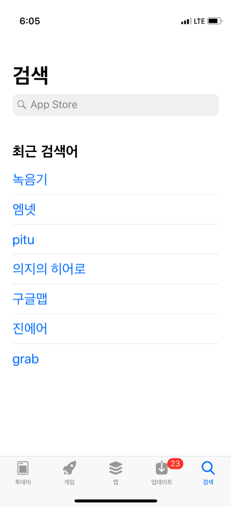
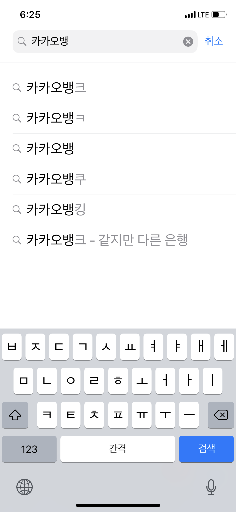
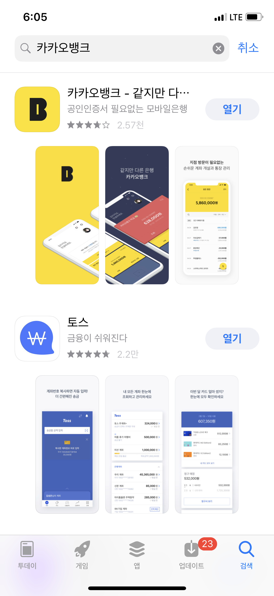
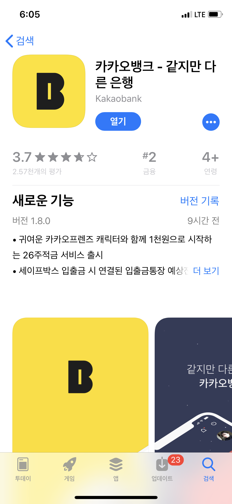

# [채널모바일개발] iOS 모바일 앱 개발자 코딩테스트

## 과제 설명

- 앱스토어 검색탭 구현

- 과제에 사용되는 API 정보는 아래 URL의 검색 API를 참고하세요.
  - [검색 API](https://affiliate.itunes.apple.com/resources/documentation/itunes-store-web-service-search-api/ "앱스토어")
  
  
 --- 
    

## 개발 요건

### 필수 조건

- [ ] 검색창에는 한글 입력만 가능하도록 구현

- [ ] 인기 검색어 대신 최근 검색어로 교체하여 구현(표시는 최대 10개)

- [ ] 검색시 연관검색어 대신 히스토리에서 검색하여 표시

- [ ] 검색 결과 화면은 스크린샷과 동일하게 구현

- [ ] 상세 화면은 제공되는 API내에서 최대한 구현

### 개발 환경

- Xcode 10이상, Swift 4.2이상

### 인터페이스

- xib를 사용하지 않고 Storyboard 와 Autolayout을 사용하여 구성

### 라이브러리

- 오픈소스 사용 가능 (단, Alamofire와 같은 네트워크 관련 라이브러리 사용제한, 이미지 다운로드 포함)

- cocoapod, carthage 등 사용시, 프로젝트에 프레임워크를 포함해서 commit해 주세요.

  

### 스크린샷
---

    
    
    
    

